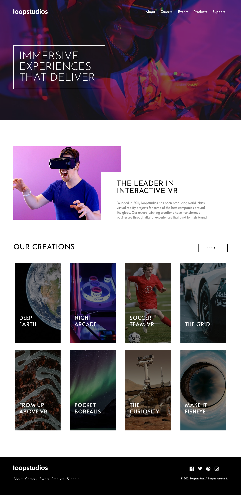

# Frontend Mentor - Loopstudios landing page solution

This is a solution to the [Loopstudios landing page challenge on Frontend Mentor](https://www.frontendmentor.io/challenges/loopstudios-landing-page-N88J5Onjw). Frontend Mentor challenges help you improve your coding skills by building realistic projects.

## Table of contents

- [Overview](#overview)
  - [The challenge](#the-challenge)
  - [Screenshot](#screenshot)
  - [Links](#links)
- [My process](#my-process)
  - [Built with](#built-with)
  - [What I learned](#what-i-learned)
  - [Continued development](#continued-development)
- [Author](#author)

## Overview

### The challenge

Users should be able to:

- View the optimal layout for the site depending on their device's screen size
- See hover states for all interactive elements on the page

### Screenshot

### Links

- Solution URL: [click here](https://github.com/Malik-Muhammed/loopstudios)
- Live Site URL: [click here](https://malik-muhammed.github.io/loopstudios/)

## My process

### Built with

- Semantic HTML5 markup
- Flexbox
- CSS Grid
- Mobile-first workflow

### What I learned

I was able to use it to revise my knowledge of CSS grid.

### Continued development

- improvement on my mobile-first workflow
- improvement on my layout approach

## Author

- Frontend Mentor - [@Malik-Muhammed](https://www.frontendmentor.io/profile/Malik-Muhammed)
- Twitter - [@maliqlanre](https://www.twitter.com/maliqlanre)
